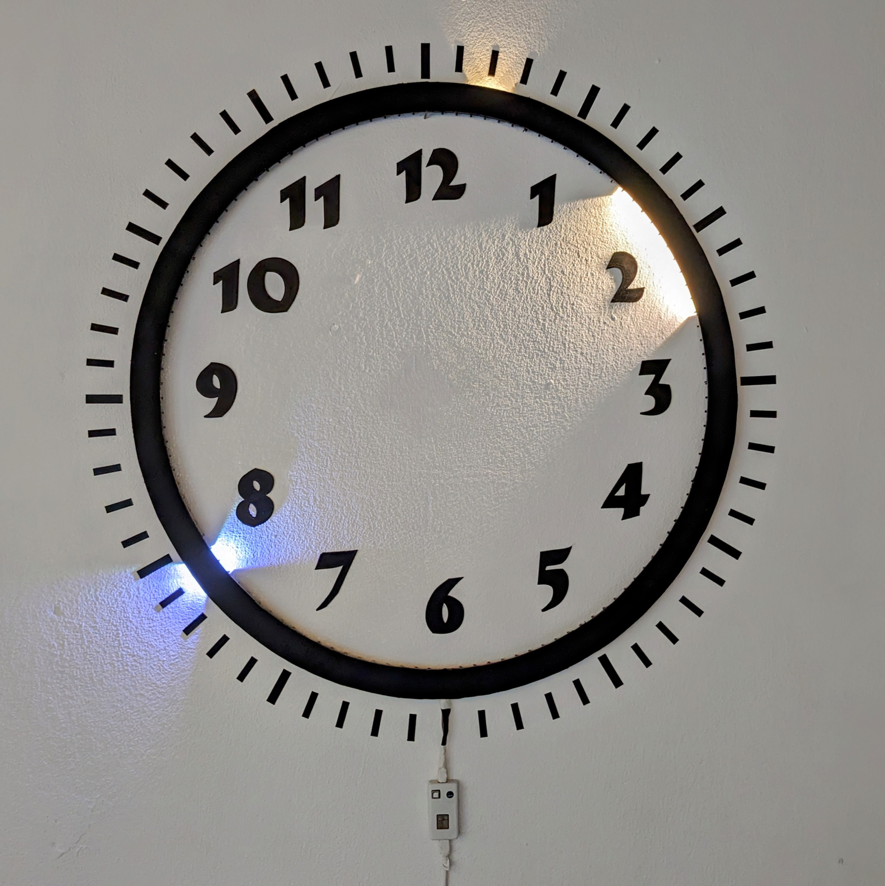

# Lightring

All important parts and files for building an addressable smart led ring which can be used for displaying the time. This is NOT a complete guide for how to build it yourself and rather a (hopefully helpful) list on what things are needed for someone with sufficient background knowledge interested in building this or something similar.



#### Features
- Automatic brighness adjustment (using BH1750 sensor)
- RGB+warmwhite addressable leds (SK6812)
- Tasmota web interface
  - Control color
  - Switch between modes
  - View sensor information
  - Smart home integration via MQTT
- SCD40 sensor
  - CO2 levels (second hand turns red at 1000ppm)
  - Humidity
  - Temperature (very inaccurate because of internal heating)

#### 3D Printed Parts
- 12 x frame parts
- 12 x frame clippers
- esp and sensor case

#### Electrical Parts
- esp8266 d1 mini (some may have different fits and may not be compatible with the provided PCB!!!) [link](https://de.aliexpress.com/item/32651747570.html?spm=a2g0o.order_list.order_list_main.26.18c45c5fDkONT1&gatewayAdapt=glo2deu)
- 4 x sk6812 light strip (RGBWW; 1m; 60 leds; IP30) [link](https://de.aliexpress.com/item/32476317187.html?spm=a2g0o.order_list.order_list_main.81.18c45c5fDkONT1&gatewayAdapt=glo2deu)
- EasyEDA PCB (you have to order yourself [here](https://easyeda.com/editor) using the EasyEDA_pcb.json)
- SCD40 sensor [link](https://de.aliexpress.com/item/1005005061351244.html?spm=a2g0o.order_list.order_list_main.31.18c45c5fDkONT1&gatewayAdapt=glo2deu)
- BH1750 sensor [link](https://de.aliexpress.com/item/32672074071.html?spm=a2g0o.order_list.order_list_main.46.18c45c5fDkONT1&gatewayAdapt=glo2deu)

#### Software
  - ESP Home: `esphome run lightring.yml`
  - [Custom Tasmota version](https://github.com/stephanballer/lightring_tasmota)

#### Useful commands to configure Tasmota
  - Clock mode: ```scheme 5```
  - Set amount of leds: ```pixels 240```
  - Make clock go counterclockwise: ```setoption16 1``` 
  - 2 channels for RGB and WW: ```setoption68 1```
  - Set hand colors (for WW set R=00 and G=B, e.g. RGB <- 001212):
    - Second (white): ```color3 FFFFFF```
    - Minute (warmwhite): ```color4 00FFFF```
    - Hour (warmwhite): ```color5 00FFFF```
    - Marker (off): ```color6 000000```
  - Let second hand turn red if CO2 levels too high: ```Rule1 on SCD40#CarbonDioxide>1000 do color3 #FF0000 endon on SCD40#CarbonDioxide<=1000 do color3 #FFFFFF endon"```
  - Rotate around 60 pixels: ```rotation 60```

#### Tasmota module config
  - D2 -> I2C SDA
  - D1 -> I2C SCL
  - D5 -> WS2812
